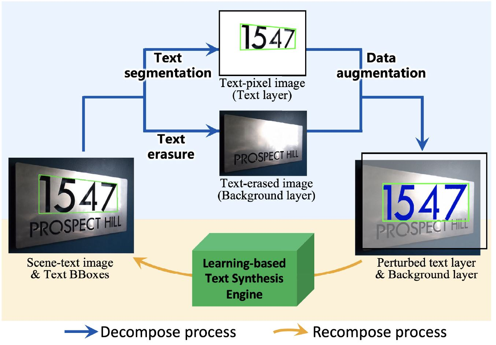
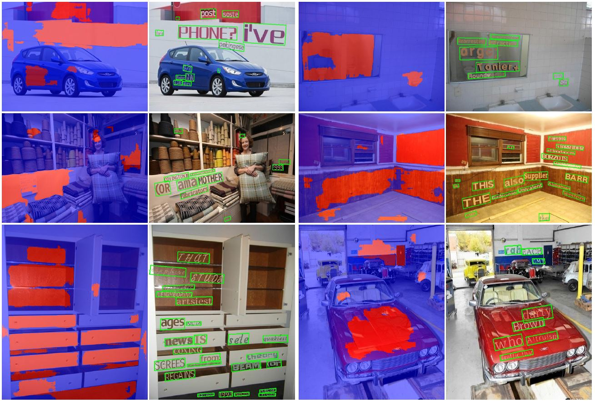

# Learning-based Scene-text Synthesis Engine

This repository is a PyTorch implementation of the following paper:

**A Scene-Text Synthesis Engine Achieved Through Learning from Decomposed Real-world Data** | [IEEE Xplore](https://ieeexplore.ieee.org/document/10299591)

Zhengmi Tang, Tomo Miyazaki, and Shinichiro Omachi.

Graduate School of Engineering, Tohoku University




## Training Data Preparation

You can download our [DecompST dataset](https://github.com/iiclab/DecompST) to train the networks.

## Requirements

```
PyTorch==1.8.1
tqdm==4.55.1
torchvision==0.9.1
opencv-python==4.5.1.48
```

## Data Generation

- prepare the raw background images, fonts, and text lexicon as generation materials. Examples are shown in `./data` file.
- download our [trained models](https://www.notion.so/Learning-based-Scene-text-Synthesis-Engine-4933aa80b8d847d18ea0ee55405a6e96?pvs=21) and put them in the `./ckpt` folder.
- revise the `bg_dir` with the right path in `TLPNet/infer.py`
- run

```
python TLPNet/infer.py
```

- revise the `Heatmap_dir`, `Ibg_dir`, `save_path`, and other hyperparameters with the right path and value in `TAANet/cfg.py`.
- run

```
python TAANet/gen.py
```

- (the generation is slow due to the CPU and GPU process and data transfer. If the generation breaks during the process, turn the `G_resume` to True to continue.)

**Note that our code now only supports data generation on a single GPU or CPU. We recommend you use Linux OS to run the code.**

## Citation

If you find our method or code useful for your research, please cite:

```
@article{LBTS2023tang,
  author = {Tang, Zhengmi and Miyazaki, Tomo and Omachi, Shinichiro},
  journal = {IEEE Transactions on Image Processing},
  title = {A Scene-Text Synthesis Engine Achieved Through Learning From Decomposed Real-World Data},
  year = {2023},
  volume = {32},
  pages = {5837-5851}
}

```
